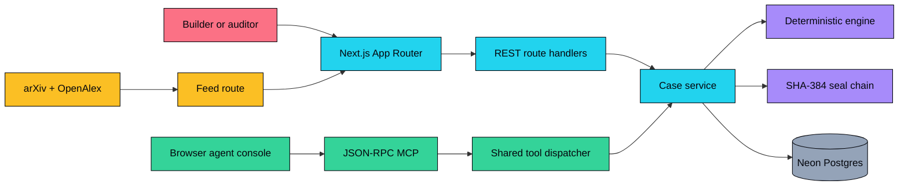
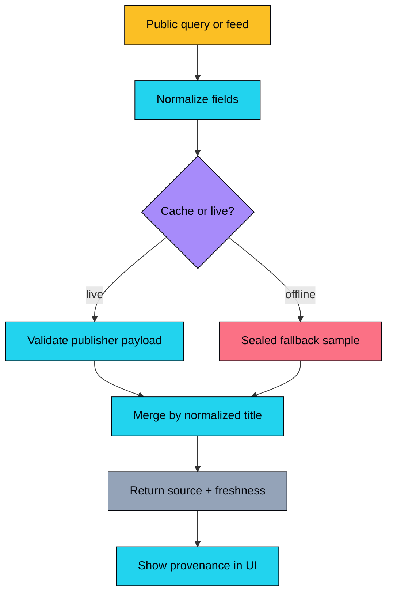
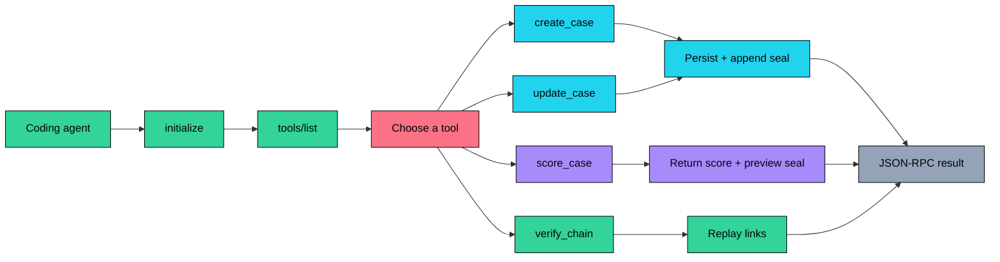
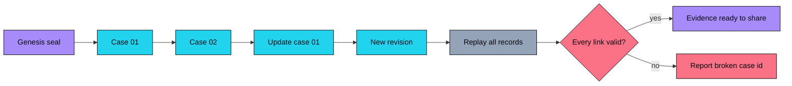
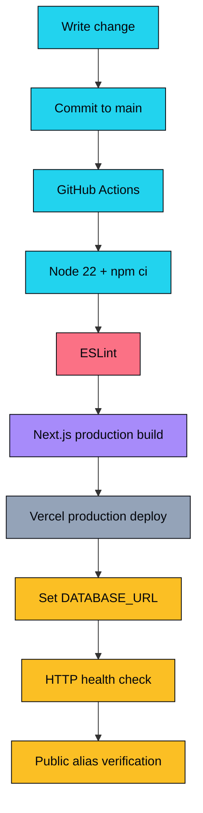
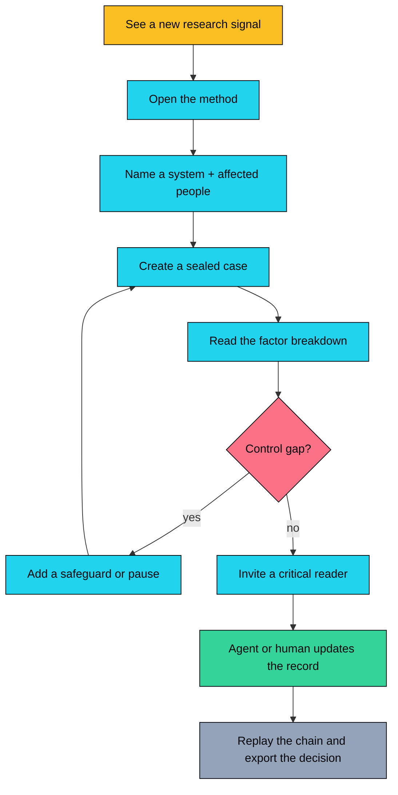
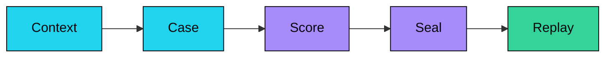
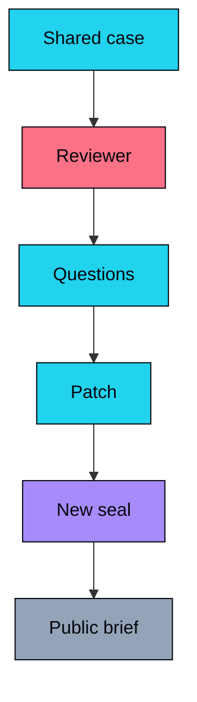
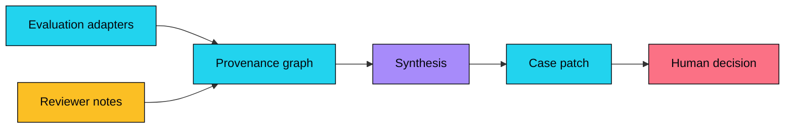

<div align="center">

# ✦ Stewardship Ledger

### Make AI power answerable.

A public, evidence-first casebook for care, control, and accountable AI systems.
Model the trade-offs, name the people who can stop the action, and leave a seal another person can replay.

[](https://stewardship-ledger.vercel.app)
[](LICENSE)
[](https://nextjs.org/)
[](https://www.typescriptlang.org/)
[](https://neon.tech/)
[](#-mcp)

[Live App](https://stewardship-ledger.vercel.app) · [API](https://stewardship-ledger.vercel.app/api/health) · [MCP](https://stewardship-ledger.vercel.app/mcp) · [Issues](https://github.com/aniruddhaadak80/stewardship-ledger/issues)

</div>

> **Educational governance tool.** Stewardship Ledger helps people make assumptions and trade-offs visible. It does not certify a model, authorize a deployment, or replace legal, clinical, security, or affected-person review.

## ✨ Features

- **Relational control-risk engine** — five explainable factors: autonomy, irreversibility, oversight gap, impact radius, and voice gap.
- **Real case CRUD** — create, read, update, retire, search, and filter persistent stewardship cases.
- **Public research context** — normalized arXiv and OpenAlex signals with sealed offline fallback samples.
- **Replayable evidence** — each revision stores a SHA-384 digest linked to the previous digest.
- **Agent surface** — REST plus JSON-RPC MCP tools for reads, scores, chain verification, and real mutations.
- **Care-centered UX** — consent, appeal, reversibility, and accountable human contact are visible controls.
- **Zero-key local start** — the core app runs with an in-memory adapter; Neon is only needed for durable production data.

## 🧭 Why this exists

Frontier-agent safety is often presented as a leaderboard, a policy document, or a single red/green score. Those views can hide the relationships that matter in practice: who has authority, who can stop an action, who can appeal, and whether the people affected can change the outcome.

Stewardship Ledger turns those relationships into a case that a builder, reviewer, or coding agent can inspect and revise together.

### Jobs-to-be-done

1. **A builder can** create and update a case **so that** a safety decision has an owner, an explicit context, and a reversible path.
2. **An auditor can** inspect the factor breakdown and replay the seal chain **so that** a claim is not separated from its evidence.
3. **A coding agent can** call the public MCP tools **so that** it can help maintain the shared record without a private integration or hidden database.

## 🏗️ System architecture



The same `CaseService` functions power the browser, REST handlers, and MCP dispatcher. The engine is pure and deterministic; the database adapter is the only persistence boundary.

## 🔄 Data pipeline



`GET /api/feed` uses a 15-minute Next.js revalidation window. If either publisher is unavailable, the response remains useful and marks which sources are live or fallback.

## 🧮 Engine / algorithm flow

```mermaid
flowchart LR
  I[Case fields] --> N[Normalize + clamp 0..100]
  N --> A[Autonomy × .28]
  N --> R[(100 − reversibility) × .18]
  N --> O[(100 − oversight) × .22]
  N --> P[Impact × .20]
  N --> V[(100 − voice) × .12]
  A --> S[Weighted sum]
  R --> S
  O --> S
  P --> S
  V --> S
  S --> B[Band + factors + next moves]
  B --> U[Same result in UI, REST, MCP]
  classDef data fill:#22d3ee,color:#04060c,stroke:#04060c
  classDef engine fill:#a78bfa,color:#04060c,stroke:#04060c
  classDef agent fill:#34d399,color:#04060c,stroke:#04060c
  classDef external fill:#fbbf24,color:#04060c,stroke:#04060c
  classDef risk fill:#fb7185,color:#04060c,stroke:#04060c
  classDef infra fill:#94a3b8,color:#04060c,stroke:#04060c
  class I,N,A,R,O,P,V,S,B data
  class N,S,B,U engine
  class U agent
  class R,O risk
```

The result is an explainable signal, not a scientific claim. The UI exposes every contribution and the recommendations generated from weak controls.

## 🤖 Agent (MCP) flow



The public endpoint is `POST /mcp`. The in-page console calls the same route, so a successful “create case” button really creates a persisted record.

## 🔐 Integrity / seal chain



Each digest is `SHA-384(previousSeal ‖ canonicalJson({ input, score }))`. Retiring a case is a sealed revision, so a visible deletion does not erase the history that preceded it.

## 🚀 Deployment pipeline



The app has no required API key for the core experience. Production persistence uses a pooled Neon connection; local development can run without it.

## 🧑‍🤝‍🧑 User journey



## 🚀 Quickstart

```bash
git clone https://github.com/aniruddhaadak80/stewardship-ledger.git
cd stewardship-ledger
npm install
npm run dev
```

Open `http://localhost:3000`. No environment variables are required for the local demo: cases use an in-memory adapter and the app seeds four example records.

For durable local or production data, copy `.env.example` to `.env.local`, set a pooled Neon `DATABASE_URL`, and apply `db/schema.sql` to the database. The Vercel production environment needs only:

```bash
vercel env add DATABASE_URL
```

Do not commit `.env.local` or database credentials.

### Useful commands

```bash
npm run lint
npm run build
npm run start
```

## 🔌 API

Base URL: `https://stewardship-ledger.vercel.app`

### Health

```bash
curl https://stewardship-ledger.vercel.app/api/health
```

### List and create

```bash
curl "https://stewardship-ledger.vercel.app/api/cases?status=active"

curl -X POST https://stewardship-ledger.vercel.app/api/cases \
  -H "Content-Type: application/json" \
  -d '{
    "title": "Benefits navigator pilot",
    "system": "Public-service eligibility agent",
    "context": "The agent helps residents discover support and routes complex cases to a caseworker.",
    "autonomy": 42,
    "reversibility": 88,
    "oversight": 73,
    "affected": 84,
    "voice": 82,
    "safeguards": "No final decisions, translated explanations, appeal handoff, weekly fairness review.",
    "owner": "Digital rights clinic"
  }'
```

The response contains `case.id`, `case.score`, and `case.seal.digest`. Read it back with:

```bash
curl https://stewardship-ledger.vercel.app/api/cases/<case-id>
```

### Update, retire, score, feed, verify

```bash
curl -X PATCH https://stewardship-ledger.vercel.app/api/cases/<case-id> \
  -H "Content-Type: application/json" \
  -d '{"oversight": 84, "voice": 90}'

curl -X DELETE https://stewardship-ledger.vercel.app/api/cases/<case-id>

curl -X POST https://stewardship-ledger.vercel.app/api/score \
  -H "Content-Type: application/json" \
  -d '{"case":{"title":"Preview","autonomy":74,"reversibility":36,"oversight":48,"affected":69,"voice":42}}'

curl https://stewardship-ledger.vercel.app/api/feed
curl https://stewardship-ledger.vercel.app/api/verify
```

The complete machine-readable contract is available at `/api/openapi`.

## 🧰 MCP setup

The endpoint accepts JSON-RPC 2.0 requests at `/mcp`. A remote MCP client can use the checked-in manifest:

```json
{
  "mcpServers": {
    "stewardship-ledger": {
      "transport": "streamable-http",
      "url": "https://stewardship-ledger.vercel.app/mcp"
    }
  }
}
```

Available tools:

- `list_cases` — read and filter the ledger.
- `get_case` — read factors, history, and seal.
- `create_case` — persist a new sealed case.
- `update_case` — patch and reseal a case.
- `score_case` — preview a score without persistence.
- `verify_chain` — replay all stored links.
- `retire_case` — preserve a case while marking it retired.

Example tool call:

```bash
curl -X POST https://stewardship-ledger.vercel.app/mcp \
  -H "Content-Type: application/json" \
  -d '{"jsonrpc":"2.0","id":1,"method":"tools/call","params":{"name":"score_case","arguments":{"case":{"title":"MCP preview","autonomy":70,"reversibility":40,"oversight":50,"affected":65,"voice":45}}}}'
```

## 📁 Project map

| Route | What it does |
| --- | --- |
| `/` | Landing page with the relational lattice, usefulness test, and live research signal. |
| `/ledger` | Searchable CRUD ledger with stats, create form, filters, and retire action. |
| `/cases/[id]` | Dynamic case detail with factor bars, edit form, recommendations, revision history, and seal replay. |
| `/method` | Care-centered method page with a live score workbench. |
| `/agent` | In-page JSON-RPC console with read, score, mutation, and chain verification actions. |
| `/api/health` | Service and storage health response. |
| `/api/cases` | `GET` list and `POST` create. |
| `/api/cases/[id]` | `GET`, `PATCH`, and `DELETE` (retire with preserved history). |
| `/api/score` | Deterministic score and preview seal endpoint. |
| `/api/feed` | Cached arXiv/OpenAlex normalization with offline fallback. |
| `/api/verify` | Full chain replay and optional per-case seal check. |
| `/api/openapi` | OpenAPI 3.1 contract. |
| `/mcp` | JSON-RPC MCP endpoint. |
| `public/mcp.json` | Remote MCP client manifest. |
| `db/schema.sql` | Neon table and index schema. |

## 🗺️ Roadmap

### Now · Make the first decision inspectable

- [x] Create, update, retire, and replay a stewardship case.
- [x] Show all five scoring factors and the next responsible move.
- [x] Add live research context with a sealed offline fallback.
- [x] Let an agent mutate the same public record.



### Next · Add independent review without adding a black box

- [ ] Add signed review links so another person can annotate a case.
- [ ] Add scenario presets for loss of oversight, manipulation, and uncontrolled AI R&D.
- [ ] Export a human-readable case brief with source URLs and assumptions.



### Later · Build a plural evidence commons

- [ ] Add privacy-preserving review aggregation.
- [ ] Add benchmark adapters that keep provenance attached to every claim.
- [ ] Add a red-team mode that proposes safer controls without claiming certification.



## 🛡️ Safety and evidence notes

- The score is a transparent heuristic with itemized factors. It is not a probability, certification, or substitute for expert review.
- External research links are attribution and discovery aids. Open the publisher record before relying on a claim.
- Public writes are intentionally easy to inspect. Add authentication, authorization, rate limiting, and abuse controls before storing sensitive or operational records.
- SHA-384 chaining is tamper evidence, not encryption or access control.
- The live feed is a reading aid, not a live safety alert or operational monitoring system.

## Feed attribution

The feed normalizes public records from [arXiv](https://arxiv.org/) and [OpenAlex](https://openalex.org/). The offline samples link to the [2026 Singapore Consensus](https://aisafetypriorities.org/), [Stanford HAI’s 2026 AI Index](https://hai.stanford.edu/ai-index/2026-ai-index-report/responsible-ai), [Civic AI care research](https://civic.ai/care-ai/), and related public research records. Publisher names and links remain attached to every item.

## 🤝 Contributing

Read [CONTRIBUTING.md](CONTRIBUTING.md) before opening a pull request. Small, focused contributions with a clear stewardship outcome are especially welcome.

## 📄 License

MIT. See [LICENSE](LICENSE).
